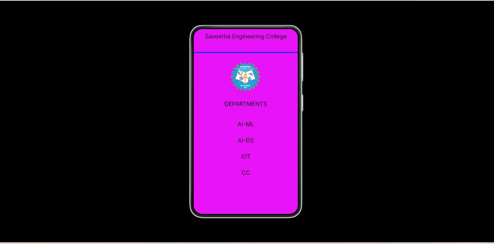
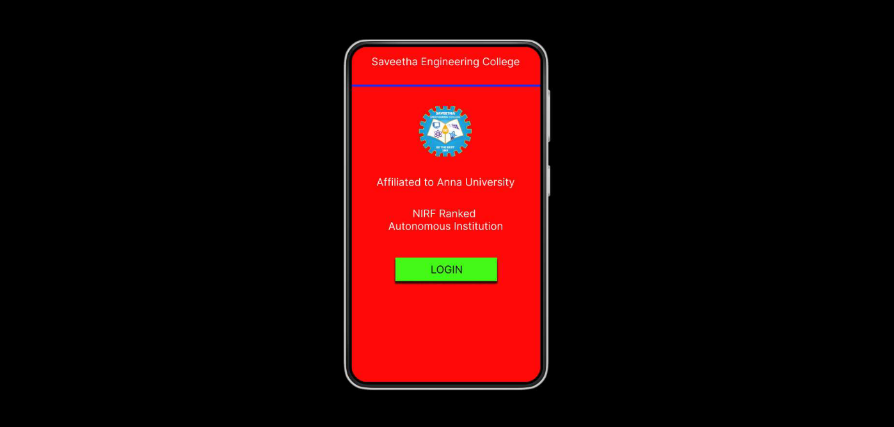
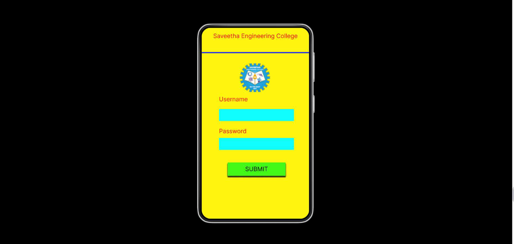

# Event Registration Web Application

## AIM:
To design, develop and deploy a web application for event registration.

## DESIGN STEPS:

### Step 1:


### Step 2:


### Step 3:


### Step 4:


### Step 5:

### Step 6:

Validate the HTML and CSS code.

### Step 6:

Publish the website in the given URL.

## DESIGN:
Omaga

## PROGRAM :
```
<!DOCTYPE html>
<html lang="en">
    <head>
         <meta name="viewport" 
         content="width=device-width, initial-scale=1.0">
         <style>

        .bookpage{
            width: 400px;
            height: 600px;
            color:crimson;
            margin-left: auto;
            margin-right: auto;
            padding: 20px;
            font-family: 'Franklin Gothic Medium', 'Arial Narrow', Arial, sans-serif;
            background-image: url(/static/images/back.jpg);
            background-size: cover;
        }
            

        .insight{
            color: blue;

        }

        
        .hrstyle{
            width:100px;
        }
        .author{
        
            display: inline;
            position: relative;
            color: purple;
            top:190px;
            
            font-family:Georgia;
            font-size: medium;
        }
        .booktitle{
            font-family: 'Courier New', Courier, monospace;
            font-size: larger;
            text-align: center;
            position: relative;
            top: 30px;
        
        }
        .id {
            width:400px;
            position: relative;
            top:180px;
            
        }
        .pub{
            font-size: medium;
            position: relative;
            top:155px;
            left:330px;
        }
        .ed{
            color:orange;
            font-size: medium;
            font-family: Verdana;
            position:relative;
            top:85px;

        }
        .subtitle{
            font-family:Tahoma;
            font-size: large;
            position: relative;
            top:40px;
        }
        .mypic{
            position: relative;
            top: 135px;
            left: 260px;
            width: 100px;
            height: 100px;
            background-size: cover;
        }
        </style>
        <title>Book Cover Page</title>
    </head>
    <body>
        <div class="bookpage">
            <div class="insight">
                SEC INSIGHT
            </div>
            <div class="hrstyle">
                <hr style="color: red;">
            </div>
            <div class="booktitle">
                <h1>Coding for beginners</h1></div>
            <div class="subtitle">
                C,C++,Python and more.
            </div>
            <div class="mypic">
                
            </div>
            <div class="id">
                <hr style="color: indigo;">
            </div>
            <div class="author">
               <p><b>Pravin</b></p>
            </div>
            <div class="pub">
                SEC
            </div>
            <div class="ed">
                <b>Seventh Edition</b>
            </div>
        </div>
    </body>
</html>
```

## OUTPUT:



## Result:
the program is successfully exicuted